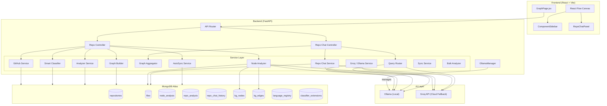

<p align="center">
  
</p>

<h1 align="center">RepoScope AI</h1>

<p align="center">
  <b>AI-Powered Code Architecture Intelligence Platform</b><br/>
  Understand any GitHub repository in minutes — not hours.
</p>

<p align="center">
  
  
  
  
  
  
  
</p>

---

## 📖 What Is RepoScope AI?

RepoScope AI is an **AI-powered code architecture intelligence platform** that transforms any public GitHub repository into an interactive, explorable dependency graph with deep AI-driven analysis.

### The Problem

Understanding a new codebase is painful. Developers spend **hours reading through unfamiliar code**, tracing import chains, figuring out which files matter, and trying to build a mental model of the architecture. Documentation — if it exists — is often outdated.

### The Solution

Give RepoScope AI a GitHub URL and it will:

1. **Download and parse** every source file (80+ file extensions, ~30 languages)
2. **Build an interactive dependency graph** showing how files relate through imports
3. **Run AI analysis on every node** — purpose, patterns, concerns, architectural role
4. **Generate a repo-level understanding** — tech stack, data flow, architecture, entry points
5. **Let you chat** with an AI about any file or the entire repository

The result: a **living, queryable knowledge base** for any codebase, built in minutes.

---

## 🛠️ Tech Stack

### Frontend

| Technology | Purpose |
|---|---|
| [React 18](https://react.dev) | UI framework |
| [Vite 5](https://vitejs.dev) | Build tool & dev server |
| [React Flow](https://reactflow.dev) (`@xyflow/react`) | Interactive dependency graph canvas |
| [Framer Motion](https://www.framer.com/motion/) | Animations (node materialization, transitions) |
| [Tailwind CSS 3](https://tailwindcss.com) | Utility-first styling |
| [Lucide React](https://lucide.dev) | Icon library |
| [Axios](https://axios-http.com) | HTTP client |
| [React Router 6](https://reactrouter.com) | Client-side routing |
| [React Markdown](https://github.com/remarkjs/react-markdown) | Markdown rendering in chat |
| [Dagre](https://github.com/dagrejs/dagre) | Directed graph layout algorithm |

### Backend

| Technology | Purpose |
|---|---|
| [FastAPI](https://fastapi.tiangolo.com) | Async Python API framework |
| [Uvicorn](https://www.uvicorn.org) | ASGI server |
| [Motor](https://motor.readthedocs.io) | Async MongoDB driver |
| [Pydantic v2](https://docs.pydantic.dev) | Data validation & settings management |
| [httpx](https://www.python-httpx.org) | Async HTTP client (GitHub API) |
| [OpenAI SDK](https://github.com/openai/openai-python) | Ollama / Groq LLM integration (OpenAI-compatible) |
| [Tree-sitter](https://tree-sitter.github.io) | Multi-language code parsing |

### Database

| Technology | Purpose |
|---|---|
| [MongoDB Atlas](https://www.mongodb.com/atlas) | Cloud-hosted document database |
| [Motor](https://motor.readthedocs.io) | Async Python driver for MongoDB |

### AI / LLM

| Technology | Purpose |
|---|---|
| [Ollama](https://ollama.ai) (Primary) | Self-hosted local LLM inference (`qwen2.5-coder:7b-instruct`) |
| [Groq](https://groq.com) (Fallback) | Cloud LLM API (`llama-3.3-70b-versatile`, `llama-3.1-8b-instant`) |

### DevOps / Tools

| Technology | Purpose |
|---|---|
| [PM2](https://pm2.keymetrics.io) | Production process manager |
| [pytest](https://docs.pytest.org) | Backend testing framework |
| [Vitest](https://vitest.dev) | Frontend testing framework |
| [Git](https://git-scm.com) | Version control |

---

## ✨ Features

### Core Intelligence

- **🔗 Interactive Dependency Graph** — Visualize how every file in a repo connects through imports/exports in a zoomable, pannable React Flow canvas
- **🚀 Parallel Analysis Engine** — Topologically sorts and processes non-dependent leaf nodes concurrently to dramatically speed up repo ingestion
- **🤖 Per-Node AI Analysis** — Every file is analyzed by an LLM for purpose, architectural role, patterns, concerns, and a one-line summary for dependents
- **🧠 Repo-Level Understanding** — Synthesized overview of the entire repository: tech stack, architecture, entry points, data flow, and key components
- **💬 AI Chat with Hive Network Routing** — Ask freeform questions about the entire repository. The **Query Router** dynamically maps your query to distinct conceptual "Hives" (e.g. *AI Services*, *Database*) precisely fetching the right context.
- **🔍 Proactive Insights** — AI surfaces 3–5 actionable insights (coupling hotspots, architectural concerns, notable patterns) without being asked

### Analysis & Detection

- **🔄 Circular Dependency Detection** — DFS cycle detection highlights import loops with animated red edges
- **👻 Dead Code Detection** — Flags files with zero importers that aren't entry points
- **🧪 Test Coverage Overlay** — Shows which source files are imported by test files (green shields)
- **📊 Complexity Scoring** — 1–10 complexity score per file with flame-colored progress bars
- **🔗 Coupling Analysis** — Bidirectional import pairs scored and visualized via edge stroke width
- **💥 Impact Analysis** — For any selected file: "X files could break if you change this" with transitive BFS traversal

### Visual & UX

- **✨ Dynamic Architectural Materialization** — Nodes start ghosted (blueprint) and "solidify" in real-time as the AI finishes analysis, with spring animations
- **⚡ Streaming RAG Chat** — AI responses stream token-by-token for near-instant First Token Latency, with automated backend reasoning stripping
- **📡 Real-Time SSE Streaming** — Server-Sent Events stream analysis progress live (no polling)
- **⌨️ Global Keyboard Shortcuts** — Rapidly navigate using `F` (Fit View), `S` (Toggle Semantic View), and `C` (Toggle Chat)
- **💻 Native Source Preview** — Instantly view syntax-highlighted raw file code directly in the component sidebar
- **📊 Progress UI** — Floating progress bar, toast notifications, and inline mini-progress in the repo list
- **🎨 Language Color Legend & Minimap** — Per-language color coding dynamically mirrors across the main canvas, the legend, and the minimap
- **🔎 Graph Search** — Fuzzy filename search with highlight-and-jump
- **📤 Graph Export** — Export as PNG (1x/2x/4x), SVG, raw JSON data, or Markdown-ready Mermaid diagrams
- **🗂️ Folder Grouping** — Nodes visually grouped by directory
- **🔄 Repository Sync** — Incremental sync with GitHub (only re-analyzes changed files + their dependents)

### Language Support

Supports **80+ file extensions** across **~30 languages** including:

> JavaScript · TypeScript · React (JSX/TSX) · Python · Java · Kotlin · Go · Rust · C/C++ · C# · Swift · Dart · Ruby · Vue · Svelte · Elixir · Haskell · Scala · SQL · GraphQL · Terraform · GLSL/WGSL — and many more

---

## 🚀 Installation & Setup

### Prerequisites

| Tool | Version | Install |
|---|---|---|
| Python | ≥ 3.11 | [python.org](https://python.org) |
| Node.js | ≥ 20 LTS | [nodejs.org](https://nodejs.org) |
| npm | ≥ 10 | Bundled with Node.js |
| Ollama | Latest | [ollama.ai](https://ollama.ai) |
| Git | Any | [git-scm.com](https://git-scm.com) |
| MongoDB Atlas | Free tier (M0) | [cloud.mongodb.com](https://cloud.mongodb.com) |

### 1. Clone the Repository

```bash
git clone https://github.com/aakash-73/RepoScope-AI.git
cd RepoScope-AI
```

### 2. Backend Setup

```bash
cd backend

# Create and activate virtual environment
python -m venv .venv
# Linux/macOS:
source .venv/bin/activate
# Windows:
.venv\Scripts\activate

# Install dependencies
pip install -r requirements.txt

# Configure environment
cp .env.example .env
# Edit .env with your MongoDB URI, Ollama config, and (optional) GitHub token
```

### 3. Pull the Ollama Model

```bash
# Make sure Ollama is running
ollama serve

# Pull the analysis model (requires ~4.5GB)
ollama pull qwen2.5-coder:7b-instruct
```

### 4. Frontend Setup

```bash
cd ../frontend

# Install dependencies
npm install
```

### 5. Start the Application

**Terminal 1 — Ollama** (if not already running):
```bash
ollama serve
```

**Terminal 2 — Backend**:
```bash
cd backend
source .venv/bin/activate    # or .venv\Scripts\activate on Windows
python main.py
# ✅ http://localhost:8000
```

**Terminal 3 — Frontend**:
```bash
cd frontend
npm run dev
# ✅ http://localhost:5173
```

---

## 📋 Usage

### Importing a Repository

1. Open `http://localhost:5173` in your browser
2. Click **"Import Repository"** in the left sidebar
3. Paste a public GitHub URL (e.g. `https://github.com/expressjs/express`)
4. Choose a branch (defaults to `main`, auto-falls back to `master`/`develop`/`dev`)
5. Click **Import** — the dependency graph appears as a ghosted blueprint
6. Watch nodes **materialize in real-time** as the AI analyzes each file

### Exploring the Graph

- **Click a node** → opens the right sidebar with file details, AI analysis, impact analysis, and chat
- **Double-click a node** → triggers AI re-analysis for that specific file
- **Search** → `Ctrl+K` or the search bar to find files by name
- **Export** → Download the graph as PNG, SVG, or JSON

### Chatting with the AI

- **File-level chat** → Select a node → Chat tab in the sidebar → Ask about that specific file
- **Repo-level chat** → Click the floating chat button → Ask about the entire repository's architecture
- **Proactive insights** → Displayed automatically in the repo chat panel

### Syncing with GitHub

- **Manual Sync** → Click the sync icon next to a repo to incrementally re-download and analyze only the changed files (and their dependents).
- **Background Auto-Sync** → Toggle the "Auto-sync" settings gear on any active repo to let RepoScope AI automatically poll for updates in the background (configurable to 1h, 6h, 12h, or 24h intervals). Visual file diffs (+ added, ~ modified, - deleted) render directly in the UI.

---

## 🏗️ Architecture / System Design

### High-Level Architecture



### Node Analysis & Chat Pipeline

The following diagram explains how the **node analysis** and **chat feature** work together to enable deep repo-level intelligence:

```mermaid
flowchart TD
    A["🚀 User Imports a GitHub Repository"] --> B["📦 GitHub Service downloads ZIP\n& extracts source files"]
    B --> C["🏷️ Smart Classifier categorizes\neach file (language, category)"]
    C --> D["🔍 Analyzer Service parses\nimports & exports per file"]
    D --> E["💾 All files stored in MongoDB\nwith metadata"]
    E --> F["📊 Graph Builder generates\ndependency graph on demand"]
    E --> G["🤖 Node Analyzer triggered\nin background"]

    G --> H["📐 Topological Sort\n(Kahn's Algorithm)\nLeaf files processed first"]
    
    H --> I["📋 Batch Processing\nLeaves processed in parallel\n(batches of 3)\nDependencies processed sequentially"]

    I --> J{"For Each File"}
    J --> K["📝 Build Rich Prompt:\n• File content (≤6000 chars)\n• Dependency summaries (already analyzed)\n• Files that import this file\n• Graph metrics (depth, in/out degree)"]
    
    K --> L["🧠 LLM Analysis\n(Ollama qwen2.5-coder)"]
    
    L --> M["📊 Structured JSON Output:\n• purpose\n• exports\n• why_connected_to (each import)\n• architectural_role\n• key_patterns\n• concerns\n• summary_for_dependents"]

    M --> N["💾 Save to node_analysis\ncollection in MongoDB\n+ Update kg_nodes & kg_edges"]
    
    N --> O["📡 SSE Event Broadcast\n→ Frontend updates node\nfrom ghosted → solid"]

    O --> P{"All Nodes\nAnalyzed?"}
    P -- "No" --> J
    P -- "Yes" --> Q["🏛️ Repo-Level Synthesis\nAggregates all node summaries"]
    
    Q --> R["💾 Save to repo_analysis\n(layer summaries, data flow,\nentry points, patterns)"]

    R --> S["✅ Repository Fully Analyzed"]

    S --> T{"User Interaction"}
    
    T --> U["💬 File-Level Chat\nUses pre-analyzed node context\n(purpose, role, patterns)\nas conversation grounding"]
    
    T --> V["💬 Repo-Level Chat\nQuery Router connects to\nConceptual Hives & Synthesis"]
    
    T --> W["💡 Proactive Insights\nAI surfaces 3-5 actionable\nfindings automatically"]

    U --> X["🧠 LLM generates contextual\nanswer about the specific file"]
    V --> Y["🧠 LLM generates contextual\nanswer about the entire repo"]
    W --> Z["🧠 LLM generates warnings,\ntips, and architectural observations"]

    style A fill:#6366f1,color:#fff
    style G fill:#f59e0b,color:#000
    style L fill:#10b981,color:#fff
    style Q fill:#8b5cf6,color:#fff
    style S fill:#22c55e,color:#fff
    style U fill:#3b82f6,color:#fff
    style V fill:#3b82f6,color:#fff
    style W fill:#3b82f6,color:#fff
```



### Repo-Level Synthesis — How Individual Nodes Are Mapped

After every file has been individually analyzed, the system runs `analyze_repo_level()` to **aggregate all node-level summaries** into a single, cohesive repository understanding.

---

## 📁 Folder Structure

```
reposcope-ai/
├── backend/
│   ├── main.py                        # FastAPI app entry point + lifespan startup
│   ├── config.py                      # Pydantic settings (env vars)
│   ├── database.py                    # MongoDB connection helpers + index creation
│   ├── requirements.txt               # Python dependencies
│   ├── logging.conf                   # Structured logging configuration
│   ├── .env.example                   # Environment template
│   ├── controllers/
│   │   ├── repo_controller.py         # Repo import, graph, explain, node chat
│   │   └── repo_chat_controller.py    # Repo-level summary, chat, insights
│   ├── services/
│   │   ├── github_service.py          # ZIP download + file extraction from GitHub
│   │   ├── smart_classifier.py        # Multi-priority file language classifier
│   │   ├── classifier_registry.py     # MongoDB-backed classifier rules cache
│   │   ├── classifier_seed.py         # Seeds 80+ classifier rules on first startup
│   │   ├── analyzer_service.py        # Multi-language import/export parser
│   │   ├── graph_builder.py           # Dependency graph + analytics computation
│   │   ├── graph_service.py           # Graph data access helpers
│   │   ├── node_analyzer_service.py   # Background per-node LLM analysis pipeline + KG Population
│   │   ├── groq_service.py            # LLM service (explain, chat, retry logic)
│   │   ├── repo_chat_service.py       # Repo-level understanding + streaming chat
│   │   ├── query_router_service.py    # Hive Network Router mapping queries to concepts
│   │   ├── graph_aggregator_service.py# Aggregates graph data into semantic clusters
│   │   ├── auto_sync_service.py       # Background polling engine for repository updates
│   │   ├── sync_service.py            # Incremental repo sync with GitHub
│   │   ├── language_registry.py       # Language color registry (MongoDB)
│   │   ├── llm_import_extractor.py    # Fallback LLM-based import extraction
│   │   ├── bulk_analyzer_service.py   # Batch analysis trigger
│   │   └── ollama_manager.py          # Ollama server lifecycle management
│   ├── routes/
│   │   ├── main_router.py             # All API route definitions
│   │   ├── analysis_routes.py         # Analysis status + SSE stream sub-router
│   │   ├── graph_routes.py            # Graph generation routes
│   │   └── repo_routes.py             # Repo actions
│   ├── models/
│   │   ├── repository.py              # Pydantic request/response schemas
│   │   └── repo_model.py              # Internal data models
│   └── tests/
│       ├── conftest.py                # Test fixtures
│       ├── test_api.py                # API endpoint tests
│       └── test_classifier.py         # Classifier unit tests
│
├── frontend/
│   ├── index.html                     # HTML entry point
│   ├── package.json                   # Node.js dependencies
│   ├── vite.config.js                 # Vite configuration + API proxy
│   ├── tailwind.config.js             # Tailwind CSS configuration
│   ├── postcss.config.js              # PostCSS config
│   └── src/
│       ├── App.jsx                    # Root component + routing
│       ├── main.jsx                   # React DOM entry point
│       ├── pages/
│       │   └── GraphPage.jsx          # Main page: repo selection, graph, SSE, progress
│       ├── components/
│       │   ├── graph/
│       │   │   ├── GraphCanvas.jsx    # React Flow canvas + Layout managers
│       │   │   ├── CodeNode.jsx       # Custom node: badges, ghost/solid, semantic styling
│       │   │   ├── FlowEdge.jsx       # Custom edge: circular highlight, coupling width
│       │   │   ├── FolderGroup.jsx    # Folder boundary rectangles
│       │   │   ├── GraphSearch.jsx    # Fuzzy search + highlight + jump-to
│       │   │   ├── LanguageLegend.jsx # Color legend + custom color picker
│       │   │   └── Graphexportdialog.jsx # Export modal (PNG/SVG/JSON/Mermaid)
│       │   ├── sidebar/
│       │   │   ├── ComponentSidebar.jsx # Node detail: analysis, impact, source preview
│       │   │   └── RepoList.jsx       # Left sidebar: repo list, progress, auto-sync
│       │   ├── chat/
│       │   │   └── Repochatpanel.jsx  # Floating repo-level streaming Q&A chat panel
│       │   └── ui/
│       │       ├── ImportDialog.jsx   # Repo import modal
│       │       ├── SyncDiffPanel.jsx  # Shows added/modified/removed after sync
│       │       └── ErrorBoundary.jsx  # Error boundaries for crash recovery
│       └── lib/
│           ├── api.js                 # All API calls (axios)
│           ├── cache.js               # Frontend data cache
│           ├── force-layout.js        # D3-Force layout engine for Semantic View
│           ├── graph-layout.js        # Dagre tree layout engine for Structure View
│           ├── useKeyboardShortcuts.js# Global keyboard bindings hook
│           ├── Usegraphexport.js      # Custom hook for exports
│           └── utils.js               # Common utilities and formatters
│
├── ecosystem.config.cjs               # PM2 process manager configuration
├── DEPLOYMENT.md                      # Detailed deployment guide
└── .gitignore
```

---

## 🔐 Environment Variables

Create `backend/.env` from the provided template:

```bash
cp backend/.env.example backend/.env
```

| Variable | Required | Default | Description |
|---|---|---|---|
| `MONGODB_URI` | ✅ Yes | — | MongoDB Atlas connection string |
| `DB_NAME` | No | `reposcope` | Database name |
| `OLLAMA_BASE_URL` | No | `http://localhost:11434/v1` | Ollama API base URL |
| `OLLAMA_ANALYSIS_MODEL` | No | `qwen2.5-coder:7b-instruct` | Model for heavy analysis tasks |
| `OLLAMA_CHAT_MODEL` | No | `qwen2.5-coder:7b-instruct` | Model for user-facing chat |
| `GITHUB_TOKEN` | Recommended | — | GitHub PAT (60 → 5000 req/hr) |
| `CORS_ORIGINS` | No | `["http://localhost:5173"]` | Allowed CORS origins |
| `GROQ_API_KEY` | No | — | Groq API key (cloud fallback, optional) |
| `GROQ_REPO_ANALYSIS_KEY` | No | — | Separate Groq key for repo analysis (optional) |
| `GROQ_REPO_CHAT_KEY` | No | — | Separate Groq key for chat (optional) |

---

## 📡 API Documentation

Base URL: `http://localhost:8000`

### Repository Management

| Method | Endpoint | Description |
|---|---|---|
| `POST` | `/api/v1/import` | Import a GitHub repository |
| `GET` | `/api/v1/repos` | List all imported repositories |
| `DELETE` | `/api/v1/repos/{id}` | Delete a repository and all its data |
| `POST` | `/api/v1/repos/{id}/retry` | Retry a failed import |
| `POST` | `/api/v1/repos/{id}/sync` | Incrementally sync with GitHub |
| `PATCH` | `/api/v1/repos/{id}/sync-settings` | Configure background auto-sync |

### Graph & Analysis

| Method | Endpoint | Description |
|---|---|---|
| `GET` | `/api/v1/graph/{id}` | Get dependency graph (nodes + edges + cycles) |
| `POST` | `/api/v1/repo/{repo_id}/build-graph` | Build Graph for specific view type |
| `POST` | `/api/v1/explain` | Get AI explanation for a file (cached) |
| `POST` | `/api/v1/analysis/{id}/reanalyze` | Force full re-analysis |
| `POST` | `/api/v1/analysis/{id}/node/reanalyze` | Re-analyze a single node |
| `GET` | `/api/v1/analysis/{id}/status` | Get analysis progress |
| `GET` | `/api/v1/analysis/{id}/stream` | SSE stream: `snapshot`, `node_update`, `progress`, `done` |
| `GET` | `/api/v1/analysis/{id}/repo` | Get completed repo-level synthesis document |
| `GET` | `/api/v1/analysis/{id}/node?file_path=` | Get completed node analysis document |
| `GET` | `/api/v1/health` | Health check |

### AI Chat & Content

| Method | Endpoint | Description |
|---|---|---|
| `POST` | `/api/v1/component/chat` | Chat about a specific file |
| `GET` | `/api/v1/repo/{id}/summary` | Get/generate repo-level AI summary |
| `POST` | `/api/v1/repo/{id}/chat` | Chat about the entire repository (non-streaming) |
| `POST` | `/api/v1/repo/{id}/chat/stream` | Token-by-token SSE streaming chat |
| `GET` | `/api/v1/repo/{id}/chat/history` | Fetch chat history |
| `DELETE` | `/api/v1/repo/{id}/chat/history` | Clear chat history |
| `GET` | `/api/v1/repo/{id}/insights` | Get proactive AI insights |
| `GET` | `/api/v1/repo/{id}/file/content?file_path=` | Fetch raw source code for a file |

### Languages

| Method | Endpoint | Description |
|---|---|---|
| `GET` | `/api/v1/languages` | List all languages (optionally filter by `repo_id`) |
| `GET` | `/api/v1/languages/{key}` | Get a specific language entry |
| `PATCH` | `/api/v1/languages/{key}` | Update or reset a language color |

### Example: Import a Repository

**Request:**
```bash
curl -X POST http://localhost:8000/api/v1/import \
  -H "Content-Type: application/json" \
  -d '{"url": "https://github.com/expressjs/express", "branch": "master"}'
```

**Response:**
```json
{
  "repo_id": "665a1b2c3d4e5f6a7b8c9d0e",
  "status": "processing",
  "message": "Repository import started"
}
```

### Example: Chat About a File

**Request:**
```bash
curl -X POST http://localhost:8000/api/v1/component/chat \
  -H "Content-Type: application/json" \
  -d '{
    "repo_id": "665a1b2c3d4e5f6a7b8c9d0e",
    "file_path": "src/router/index.js",
    "message": "What middleware does this file use?",
    "history": []
  }'
```

**Response:**
```json
{
  "response": "This file uses three middleware patterns: ..."
}
```

---

## 🧪 Testing

### Backend Tests

```bash
cd backend
source .venv/bin/activate    # or .venv\Scripts\activate on Windows

# Run all tests
pytest

# Run with coverage report
pytest --cov=. --cov-report=term-missing

# Run a specific test file
pytest tests/test_api.py -v
pytest tests/test_classifier.py -v
```

**Tools used:** pytest, pytest-asyncio, pytest-cov, httpx (test client)

### Frontend Tests

```bash
cd frontend

# Run all tests
npm run test

# Run tests in watch mode
npx vitest --watch
```

**Tools used:** Vitest, @testing-library/react, @testing-library/jest-dom, jsdom

---

## 🚢 Deployment

For detailed deployment instructions, see **[DEPLOYMENT.md](DEPLOYMENT.md)**.

### Quick Start (PM2 — Production)

```bash
# Build the frontend
cd frontend && npm run build && cd ..

# Create logs directory
mkdir -p logs

# Start all services (Ollama + Backend + Frontend)
pm2 start ecosystem.config.cjs

# Check status
pm2 status

# Auto-start on reboot
pm2 save && pm2 startup
```

### Application URLs

| Service | URL |
|---|---|
| Frontend (dev) | http://localhost:5173 |
| Frontend (production) | http://localhost:4173 |
| Backend API | http://localhost:8000 |
| Swagger Docs | http://localhost:8000/docs |
| Health Check | http://localhost:8000/api/v1/health |

---

## 🤝 Contributing

Contributions are welcome! To get started:

1. **Fork** the repository
2. Create a feature branch: `git checkout -b feature/your-feature`
3. Commit your changes: `git commit -m "Add your feature"`
4. Push to the branch: `git push origin feature/your-feature`
5. Open a **Pull Request**

Please ensure:
- Backend tests pass (`pytest`)
- Frontend tests pass (`npm run test`)
- Code follows the existing project style

---

## 📄 License

This project is licensed under the **MIT License** — see the [LICENSE](https://github.com/aakash-73/RepoScope-AI/blob/main/LICENSE) file for details.

---

## 👤 Author

**Aakash Reddy**

- GitHub: [@aakash-73](https://github.com/aakash-73)
- LinkedIn: [Aakash Reddy](https://www.linkedin.com/in/aakash-reddy-nuthalapati/)

---

<p align="center">
  <i>Built with ❤️ to make understanding codebases effortless.</i>
</p>
