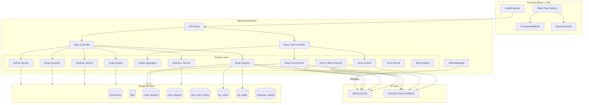

# RepoScope AI: Codebase Workspace Documentation

Welcome to the comprehensive technical documentation for **RepoScope AI**, an AI-powered code architecture intelligence platform. This document outlines the technology stack, system architecture, database models, backend services, frontend components, developer workflows, and security configurations.

---

## 🛠️ Technology Stack

### Frontend Layer
- **Core Framework**: React 18 (Vite 5 build tool & development server).
- **Graph Visualization**: React Flow (`@xyflow/react`) for canvas nodes and edges rendering.
- **Layout Engines**: 
  - **Dagre**: Structured hierarchical tree layout algorithm.
  - **D3-Force**: Custom force-directed simulation for Semantic Views.
- **Styling**: Tailwind CSS 3 for responsive UI, custom CSS for glassmorphic elements and animations.
- **Animation**: Framer Motion (for node materialization, sidebars, and chat overlays).
- **Utility Libraries**: Axios (HTTP client), Lucide React (vector icons), React Markdown (chat bubble markdown parser).

### Backend Layer
- **Web Framework**: FastAPI (Async Python 3.11 API).
- **Server**: Uvicorn ASGI server.
- **Database Access**: Motor (async MongoDB driver).
- **Validation**: Pydantic v2 (settings & request/response schemas).
- **HTTP Client**: HTTPX (async client for communicating with GitHub APIs).
- **Parsing**: Built-in Python `ast` parser, customized regular expressions, and fallback Tree-sitter parsers.

### Database Layer
- **MongoDB Atlas**: Document-based schema design representing repositories, files, analysis metadata, chat logs, and the semantic Knowledge Graph.

### AI / LLM Inference Layer
- **Ollama**: Local inference server hosting `qwen2.5-coder:7b-instruct` (primary LLM).
- **Groq**: Fallback cloud API (using Llama models) for quick chat and offline processing.

---

## 🏛️ System Architecture & Data Flow

### Ingestion Workflow
1. **GitHub Ingestion**: The user enters a repository URL. `github_service` downloads the ZIP payload asynchronously, filtering out node_modules, lockfiles, and non-code items.
2. **Classification**: Files are classified by `smart_classifier` (running `enry` if installed, otherwise defaulting to file extensions and fingerprints).
3. **Import Parsing**: `analyzer_service` runs AST-based (Python) or regex-based language analyzers to parse imports, exports, API fetch endpoints, and route declarations.
4. **Knowledge Graph Generation**:
   - `node_analyzer_service` topologically sorts files using Kahn's algorithm so dependencies are analyzed first.
   - Non-dependent "leaf" nodes are processed in parallel batches of 3, while dependents are analyzed sequentially to inject dependent file summaries into LLM prompts.
   - Analyzed nodes write semantic triplets (File $\rightarrow$ `belongs_to` $\rightarrow$ Category, File $\rightarrow$ `has_role` $\rightarrow$ Role, File $\rightarrow$ `implements` $\rightarrow$ Pattern) into `kg_nodes` and `kg_edges` MongoDB collections.
5. **Repo-Level Synthesis**: After all nodes are processed, `analyze_repo_level()` groups files by layer and synthesizes the entire repository context into a single cohesive document (`repo_analysis`).

---

## 🗄️ Database Schemas & Indexes

All data is stored across the following MongoDB collections:

### 1. `repositories`
Tracks metadata and sync settings for imported repositories.
- **Fields**: `repo_id`, `name`, `owner`, `branch`, `file_count`, `imported_at`, `github_url`, `unique_key`, `client_id`, `status` (`ready` | `pending` | `failed`), `error_message`, `last_commit_sha`, `last_synced_at`, `auto_sync` (boolean), `sync_interval_minutes`.
- **Indexes**:
  - `repo_id` (unique)
  - `unique_key` (unique)

### 2. `files`
Stores the raw file content and parsed dependency relations.
- **Fields**: `repo_id`, `path`, `name`, `extension`, `content`, `size`, `category`, `language`, `github_url`, `imports`, `exports`, `analysis_status` (`pending` | `analyzed` | `failed`), `content_hash`.
- **Indexes**:
  - `(repo_id, path)` (unique index `repo_file_unique_index`)
  - `exports`
  - `imports`
  - Text search index: `(path, content)` with dummy language override.

### 3. `node_analysis`
Holds the structured JSON output from LLM file analysis.
- **Fields**: `repo_id`, `file_path`, `status` (`pending` | `analyzing` | `done` | `failed`), `analyzed_at`, `analysis` (object containing: `purpose`, `exports`, `why_connected_to`, `architectural_role`, `functional_categories`, `key_patterns`, `concerns`, `summary_for_dependents`), `error`.
- **Indexes**:
  - `(repo_id, file_path)` (unique)
  - `(repo_id, status)`
  - `analysis.architectural_role`
  - `analysis.functional_categories`
  - `analysis.key_patterns`

### 4. `repo_analysis`
Stores synthesized understanding of the entire repository.
- **Fields**: `repo_id`, `overall_summary`, `data_flow`, `architectural_patterns`, `layer_summaries` (`frontend`, `backend`, `database`, `devops`), `entry_points`, `status`, `analyzed_at`, `error`.
- **Indexes**:
  - `repo_id` (unique)

### 5. `kg_nodes` & `kg_edges`
Constitutes the Semantic Knowledge Graph.
- **Nodes**: `repo_id`, `id` (e.g. `cat__authentication`), `type` (`file` | `category` | `role` | `pattern`), `label`, `properties`.
- **Edges**: `repo_id`, `source` (file node ID), `target` (concept node ID), `relation` (`belongs_to` | `has_role` | `implements` | `imports`), `weight`.
- **Indexes**:
  - `(repo_id, id)` (unique)
  - `(repo_id, type)`
  - `(repo_id, source)`
  - `(repo_id, target)`
  - `(repo_id, relation)`

### 6. `repo_chat_history`
Maintains conversational context between users and repositories.
- **Fields**: `repo_id`, `messages` (list of `{ role, content }`).
- **Indexes**:
  - `repo_id` (unique)

---

## 📡 API Routing Layer

The API endpoints are grouped under the `/api/v1` namespace inside [main_router.py](file:///c:/Users/MyComp/OneDrive/Desktop/reposcope-ai/backend/routes/main_router.py) and [analysis_routes.py](file:///c:/Users/MyComp/OneDrive/Desktop/reposcope-ai/backend/routes/analysis_routes.py):

### 1. Repository Management
- `POST /import`: Starts repository ingestion. Returns 201 on success or 409 if repository already exists.
- `GET /repos`: Returns list of all imported repositories matching client ID.
- `DELETE /repos/{repo_id}`: Deletes a repository and cascades deletion to all database collections.
- `POST /repos/{repo_id}/retry`: Retries analysis for a failed repository.
- `POST /repos/{repo_id}/sync`: Triggers manual incremental sync (fetches latest commit, diffs file hash, deletes/upserts changes, re-analyzes changed node path chains).
- `PATCH /repos/{repo_id}/sync-settings`: Configures background auto-sync state and interval.

### 2. Graph & Analysis Status
- `GET /graph/{repo_id}?view_type=structure|semantic`: Returns graph nodes, edges, and cycles parsed by Kahn's DFS.
- `GET /analysis/{repo_id}/status`: Returns live file total, completed count, and execution percentage.
- `GET /analysis/{repo_id}/stream`: SSE stream broadcasting state transitions (`snapshot`, `node_update`, `progress`, `done`).
- `GET /analysis/{repo_id}/repo`: Returns repo-level synthesis.
- `GET /analysis/{repo_id}/node?file_path={path}`: Returns node-level analysis.

### 3. AI Chat & Content
- `POST /component/chat`: Converses about a specific file, grounded by the file's LLM summaries.
- `POST /repo/{repo_id}/chat/stream`: Initiates an SSE streaming chat session powered by the Query Router.
- `GET /repo/{repo_id}/insights`: Yields 3-5 proactive insights concerning coupling bottlenecks or architectural code concerns.
- `GET /repo/{repo_id}/file/content?file_path={path}`: Fetches raw, highlighted source code.

---

## 🔍 The Multi-Layer Query Router

To handle repo-level queries without hitting token limits, `query_router_service` maps incoming questions to one of five specialized RAG (Retrieval-Augmented Generation) strategies:

| Strategy | Description | Query Indicators | Backend Resolution |
|---|---|---|---|
| `exact_match` | Looks up precise symbols, class names, or routing paths | "Where is the login function?" | Matches exact entries in file `exports` or `imports` fields. |
| `fuzzy_search` | Matches text fragments and semantic code keywords | "how does JWT work" | Evaluates matches using MongoDB's `$text` scoring index. |
| `semantic` | Selects files using conceptual architectural roles | "show all controllers" | Checks files having specific `architectural_role` tags. |
| `graph` | Evaluates structural dependencies and impact loops | "what imports config.py?" | Utilizes MongoDB `$graphLookup` to trace dependents up to depth 2. |
| `hive_search` | Maps queries to abstract systems or domain classifications | "Where is local LLM logic?" | Queries the Knowledge Graph edges to extract files matching category nodes. |

---

## 🎨 Frontend Architecture

The React-based interface revolves around an interactive Graph canvas:

- **GraphCanvas.jsx**: Integrates React Flow with layout hooks.
  - **Structure View**: Lays nodes out hierarchically using the Dagre layout engine.
  - **Semantic View**: Renders files as nodes orbiting their respective Concept nodes (Roles, Patterns, Categories) utilizing a custom D3-Force simulation layout.
- **CodeNode.jsx**: Implements custom canvas nodes. Materializes in real-time from a translucent "ghost" blueprint to a solid panel as SSE streams broadcast completed analysis. Displays language colors, lines-of-code meters, and complexity flame bars.
- **FlowEdge.jsx**: Renders edges, applying styling modifications (such as stroke thickness based on coupling scores) and animated dashed red lines if a cycle/circular path is detected.
- **ComponentSidebar.jsx**: Opens when a node is selected. Divided into four primary panels:
  - **Analysis Tab**: Purpose, exported items, architectural role, detected concerns.
  - **Impact Analysis**: Computes BFS tree of transitively impacted dependencies ("Changing this file could affect X other files").
  - **File Chat**: Chat interface specific to the selected component.
  - **Code Preview**: Renders syntax-highlighted code.
- **RepoChatPanel.jsx**: Slide-out dashboard for repository-wide streaming chat, showing reasoning output and suggested questions.

---

## 🔐 Security Safeguards & Hardening

1. **API Key Authorization**: Requests require an `Authorization: Bearer <key>` header if `API_KEY` is set in environmental settings.
2. **IDOR Prevention**: The application validates `client_id` context against the `client_id` recorded on the repository doc before handling requests.
3. **ReDoS Defense**: Regex expressions derived from user/AI data are evaluated in a `ThreadPoolExecutor` using a timeout limit of `1.0s` to block denial-of-service attempts.
4. **Directory Traversal Defense**: All input URLs, branch configurations, and file paths are checked against strict path-traversal patterns (`..`).

---

## 🧪 Testing Harness

### Backend Tests (`pytest`)
- Run tests: `pytest`
- Code coverage: `pytest --cov=. --cov-report=term-missing`
- Main files:
  - `tests/conftest.py`: Mocks MongoDB drivers, LLM clients, and config objects.
  - `tests/test_api.py`: Validates controllers and router endpoints.
  - `tests/test_classifier.py`: Validates extension categorization.

### Frontend Tests (`vitest`)
- Run tests: `npm run test`
- Interactive runner: `npx vitest --watch`
- Frameworks used: Vitest, React Testing Library, jsdom.
